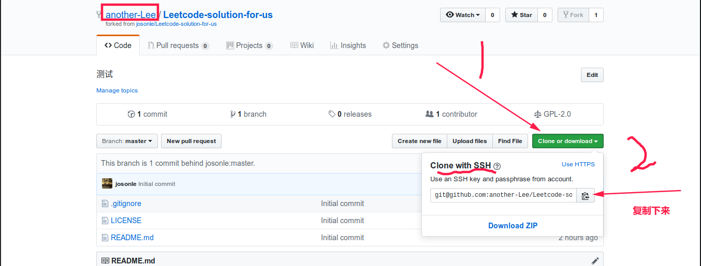
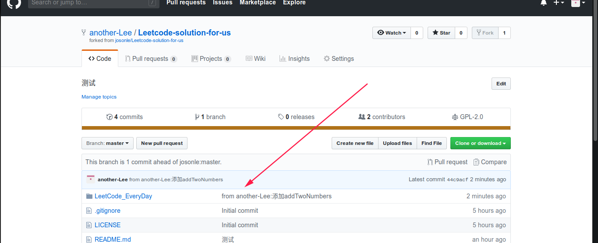
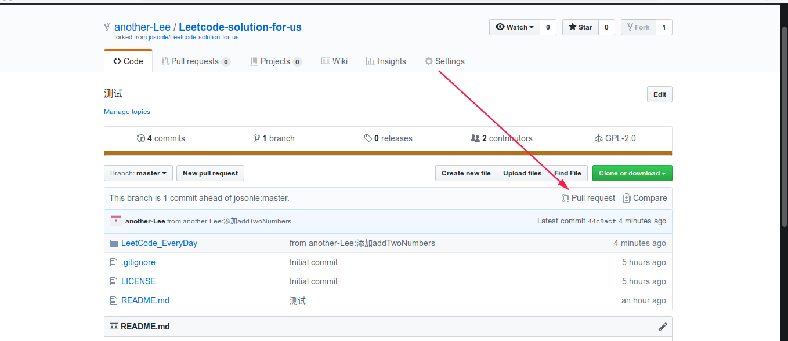
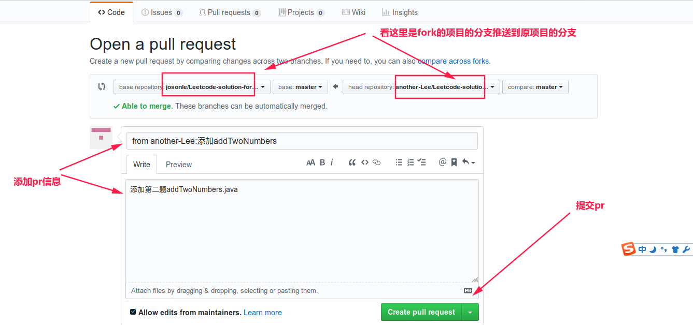
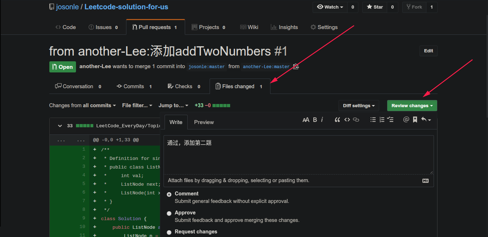
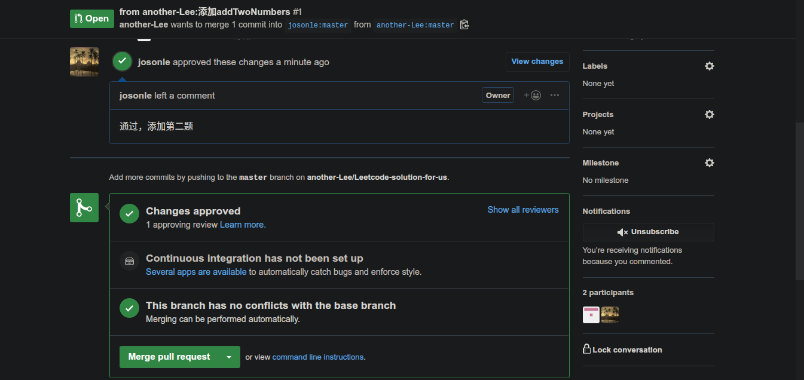
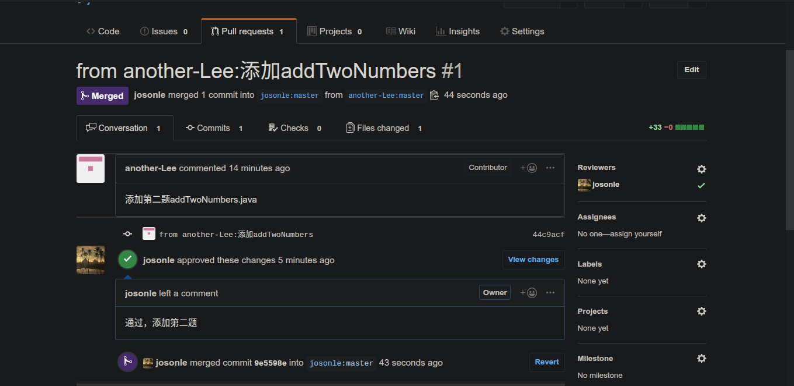
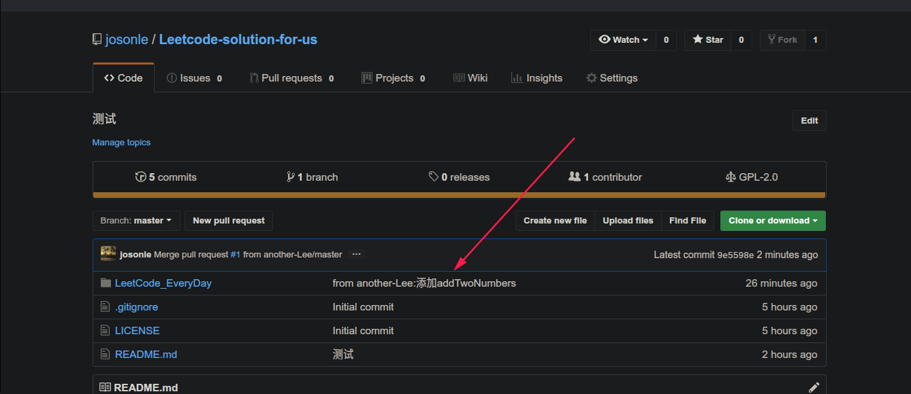

# Leetcode-solution-for-us
面试准备，刷题，面经分享，技术文章分享

## Why did i built the project?

本项目面向秋招准备刷题分享群的各个小伙伴们，一来是提出一种自我监督的方式，而来是为了大家在工作前提前熟悉git操作

--------------------- 
同时也收录在csdn上：https://blog.csdn.net/lzw2016/article/details/89791579 

## How to join us ?

文章中我新建了一个账号another-Lee，并fork了该项目，然后进行了一系列操作，来同步原项目内和提交自己的题解。
初步规划了Leetcode刷题计划，面经分享，技术文章分享系列，后期大家可以商量着提议。
以下前提是已经安装了git，在linux、mac下可以直接通过命令行，Windows下可以通过好像是叫git shell操作（github desktop貌似也可以）

#### 项目要求

- 文件(夹)命名格式
  - Leetcode题放在Leetcode_EveryDay目录下，后期可以考虑添加剑指offer、面经、每日分享等目录
  - 按题分成不同文件夹，文件夹命名格式为`Topic+题号-英文题名`，如`Topic1-two-sum`
  - 你刷的题请放在对应文件夹下，如果仓库中还没有的题，请新建对应文件夹，并在文件夹下添加`README.md`（最好是中英文题目内容+链接）
  - 刷的题请以`from-<github昵称>-题名.java`格式命名，C++则以cpp结尾，github昵称用来区分不同提交
- 加入项目的小伙伴只能操作自己的文件，不要删除其他人的文件（即**不要删除从原项目clone的内容**，不要删除从原项目clone的内容，不要删除从原项目clone的内容）
- 

### 二、clone项目到本地

如图，最好选择ssh



然后选择一个文件夹，通过`git clone [复制的链接]`将项目下载到本地（前提是已经装了git，linux、mac直接终端，Windows用git shell或git Desktop）


------

### 三、设置fork的项目与原项目同步

先看下仓库下有什么，然后开始配置


- 查看所有分支，`git branch -a`

  

- 查看所有远程仓库，`git remote -v`

  

- 添加一个上游分支，指向原项目，即`git@github.com:josonle/Leetcode-solution-for-us.git`

  > `git remote add upstream git@github.com:josonle/Leetcode-solution-for-us.git`
  >
  > 再次查看远程仓库，多了一个
  >
  > 

- 先抓取上游分支的更新到本地，`git fetch upstream`，upstream是上面新建上游分支名

  > 如下图，并且多了一个分支，本地分支master，两个远程分支其中一个是源项目的
  >
  > 

- 合并原项目的远程分支，然后push到自己fork的项目上去

  - `git merge upstream/master`

    

  - `git push origin master`

    

本地仓库里和网页上查看都更新了原项目的内容，如图


### 四、fork的项目如何pull request到原项目

这里我们在another-Lee的本地仓库新建一个文件夹`Topic2-add-two-numbers`，**强调必须以【`Topic+题号+英文题名`】命名**，里面随便放点啥，比如`from-anotherLee-add-two-numbers.java`。**再次强调，提交文件以【`from-<github昵称>-题名.java`】命名，如果是C++就用cpp结尾**


先提交并推送到自己仓库去

```
$ git add .
$ git commit -m"from another-Lee:添加addTwoNumbers"
$ git push origin master 
```

> 强调，提交信息，必须是from <github昵称>:xxx格式
>
> 网页上打开查看，如图是我们刚刚推送的更新
>
> 

然后重点来了，向原项目pull request




然后创建pr


注意分支信息要设置的没问题，然后填写提交信息，标题最好不要修改（默认是commit信息）



然后pull request就结束了，后续就是我负责审核代码，并merge到原项目中去，fork的项目也无法修改pr内容


到此就结束了，以下是介绍Master如何审核代码，处理pr

------


### 原项目审核并处理pull request

打开项目，可以发现pr有提示，然后我们可以查看更改的文件，给出审核结果



如图审核结果有三种：

- 评论，未经明确批准即提交一般反馈
- 批准，提交反馈并批准合并这些更改
- 请求更改，提交在合并之前必须解决的反馈

通过后，合并pr，如图点击Merge pull request，然后confirm merge




最后，就这样了，项目中也多了another-Lee的pr过来的代码






## What will you do for the Interview?
